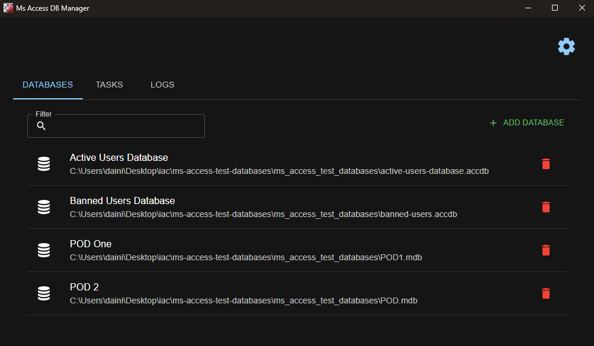
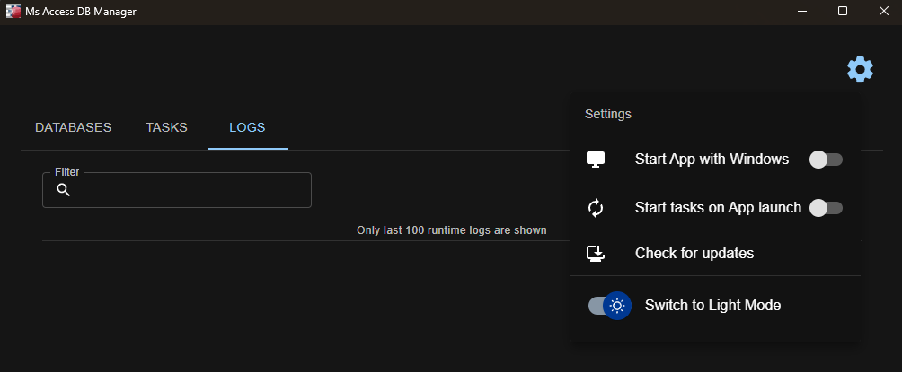
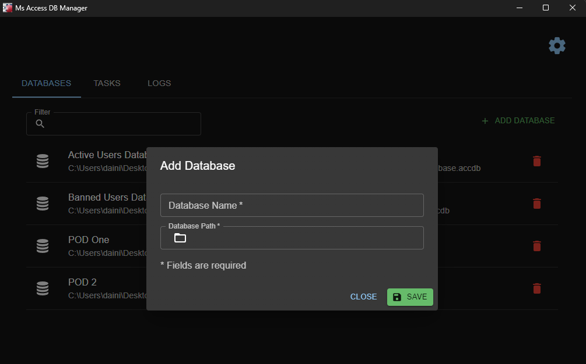
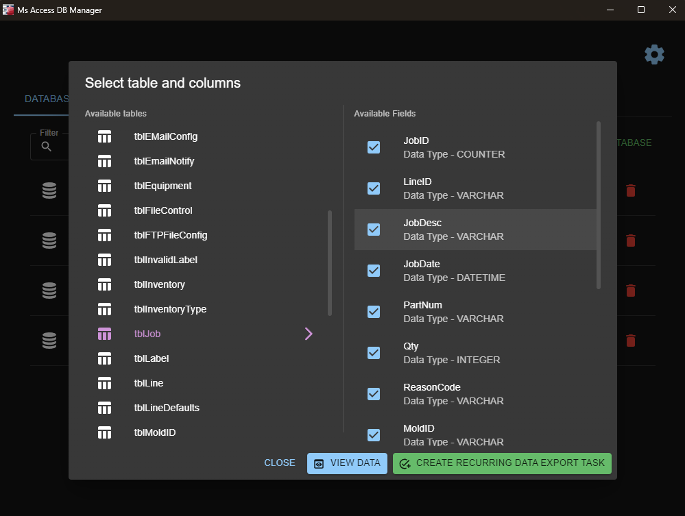
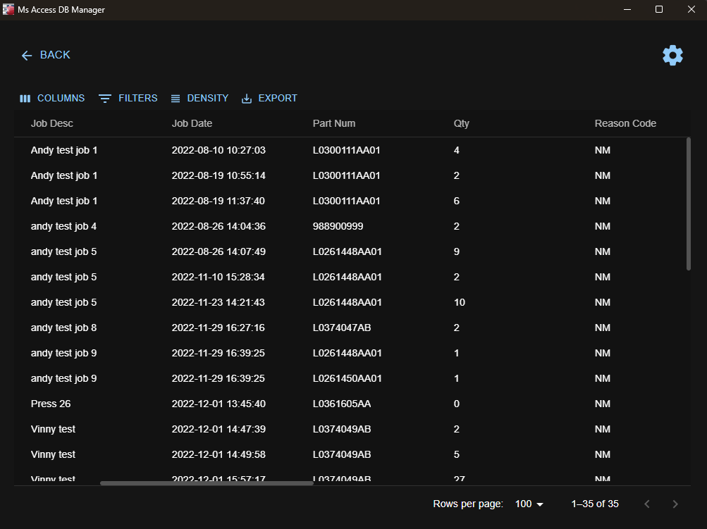
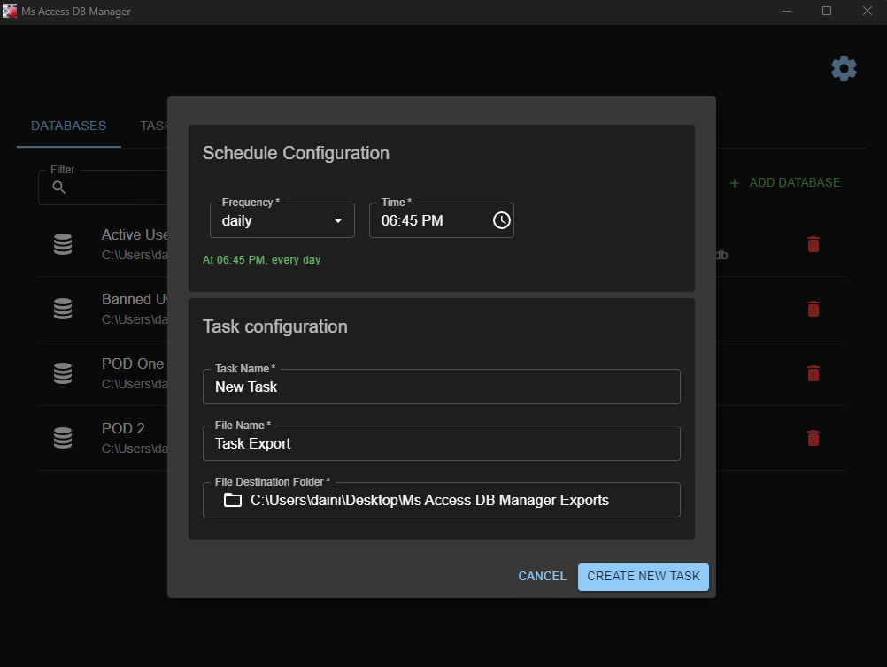
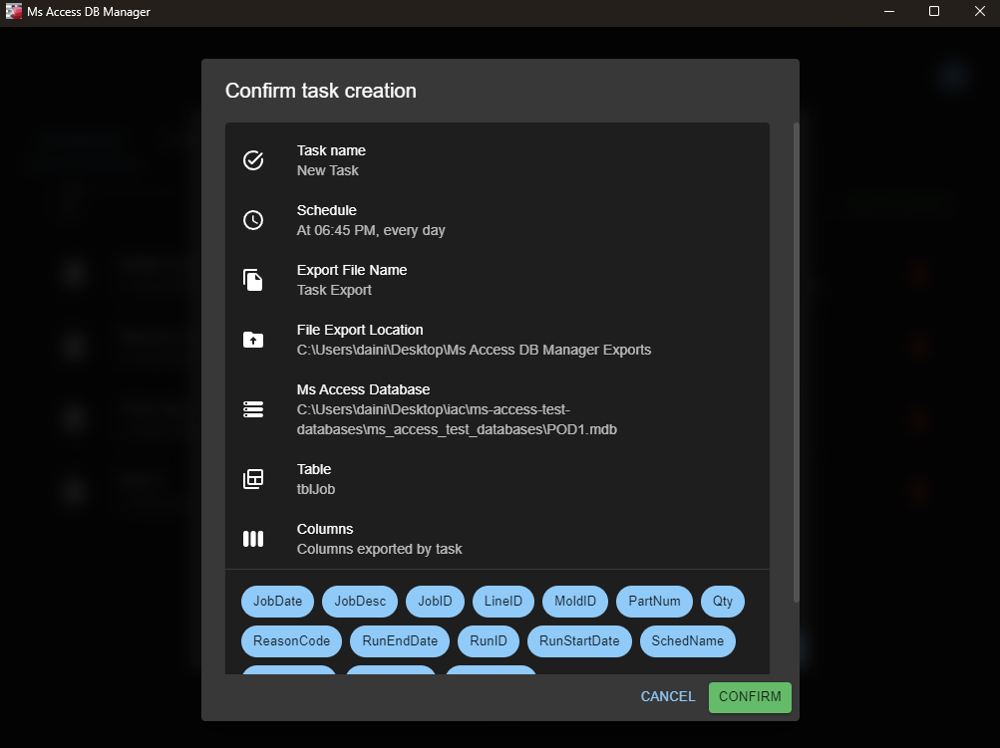
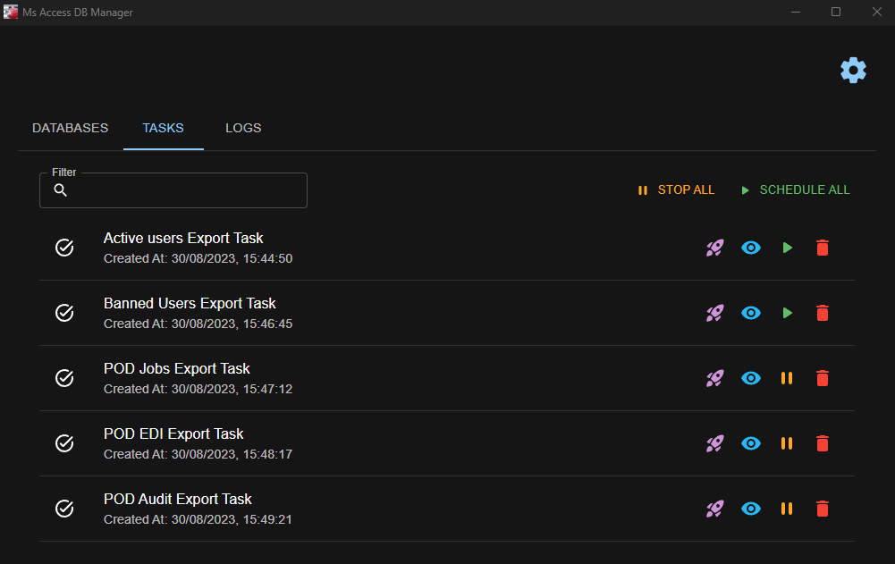
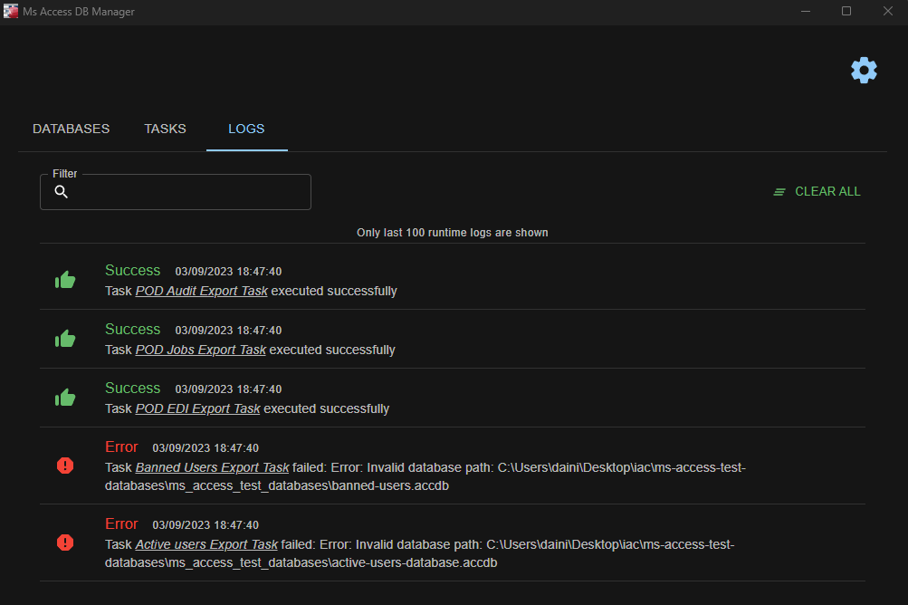

## **Contents**

- [Main Feature Overview](#main-feature-overview)
- [Application Settings](#application-settings)
- [Home Screen](#home-screen)
- [Adding a Database](#adding-a-database)
- [Database Preview](#database-preview)
- [Creating a Task](#creating-a-task)
- [TASKS Tab](#tasks-tab)
- [LOGS Tab](#logs-tab)

---

# **Main Feature Overview**

- **Add Multiple MS Access Databases**: Add multiple MS Access databases to your workspace for easy future access.
- **Database Exploration**: Browse through tables, examine column definitions, and view table contents.
- **Data Manipulation**: View, export to CSV, or print data directly from the on-screen data table.
- **Column Selection**: Choose which columns to display in the output.
- **Scheduled Tasks**: Set up automated tasks for data export from any saved database in your workspace. Customize task frequency, export file locations, and filenames.
- **Task Preview**: Quickly preview task configurations before executing them.
- **Immediate Execution**: Execute a task on-the-spot without waiting for the next scheduled run—ideal for testing.
- **Runtime Logs**: Explore logs to review task execution times and statuses.

## Application Settings

- **Theme Toggle**: Switch between light and dark themes.
- **Windows Startup**: Configure the application to launch on Windows boot.
- **Automated Task Execution**: Schedule tasks to run upon application launch.
- **Software Updates**: Check for available updates and install them. Update notes are provided for clarity on new features or bug fixes.

# **Home Screen**

### Tabs:

- **DATABASE (Default)**: View a list of databases saved to your workspace.
- **TASKS**: Preview, execute, and schedule automated data export tasks.
- **LOGS**: Check statuses of executed tasks.

### App Settings:

- **Start App with Windows**: Launch the application minimized on Windows startup.
- **Start Tasks on App Launch**: Begin execution of enabled scheduled tasks upon application launch.
- **Check for Updates**: Examine and install updates if a new version is available; read the latest release notes.
- **Switch to Light/Dark Mode**: Toggle between light and dark themes.

## Adding a Database

1. Click on the "ADD DATABASE" button.

   

2. Enter the database name.
3. Specify the location of the MS Access database (absolute path required).
4. Click "SAVE."

## Database Preview

1. Click on a database item in the "DATABASES" tab on the Home screen.

   

2. A dialog will appear, allowing you to select database tables and choose the columns you wish to view.
3. Click "VIEW DATA" to proceed to the data table view.

   

   - Here, you can view data, toggle columns, apply filters, and adjust row spacing.
   - Use the export button to export or print the displayed data.

4. Click "CREATE RECURRING DATA EXPORT TASK" to open the task creation dialog.

## Creating a Task

1. Select the task frequency.
2. Enter a task name.
3. Define the output filename (a date/time stamp will be appended upon task execution).
4. Specify the destination folder for the task output file.
5. Click "CREATE NEW TASK."
6. A task preview window will appear. Verify all settings and click "CONFIRM."

   

## TASKS Tab

Displays a list of tasks created by the user.

### Buttons:

- **STOP ALL**: Halts all tasks from further execution.
- **SCHEDULE ALL**: Queues all tasks for execution.
-  **Execute Once**: Run a task immediately without scheduling it.
-  **View Configuration**: Review task settings.
-  **Schedule Task**: Schedule a single task for execution.
-  **Stop Task**: Cease task execution.
-  **Delete Task**: Remove a task entirely.

## LOGS Tab

Check which tasks executed successfully and which failed. Logs are not persistant and are only showed for runtime events. All logs will be gone when you close the app. Only last 100 logs are shown.

### Buttons:

- **CLEAR ALL**: clears all runtime logs
